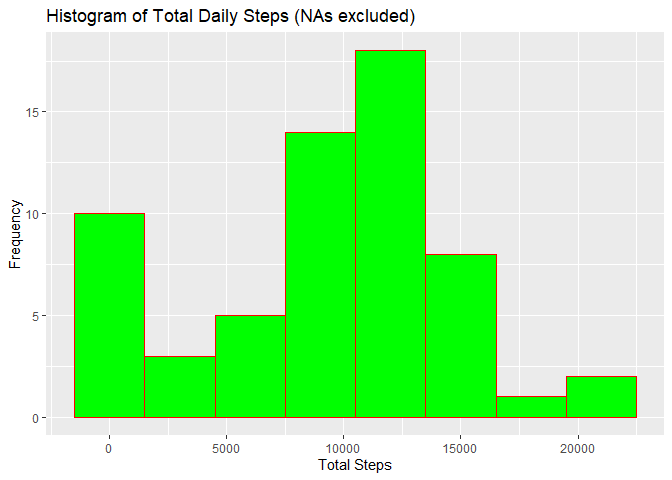
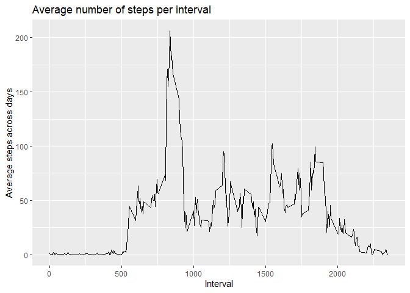
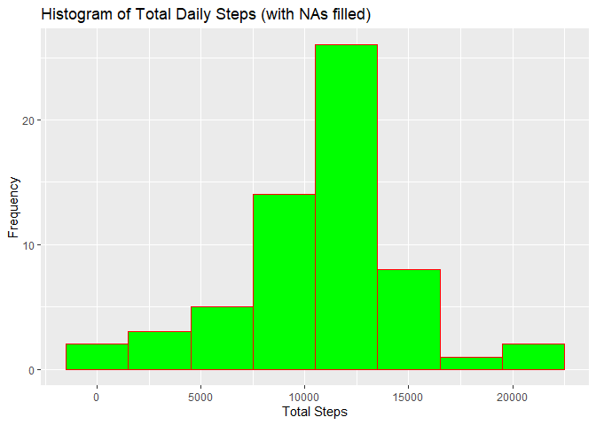
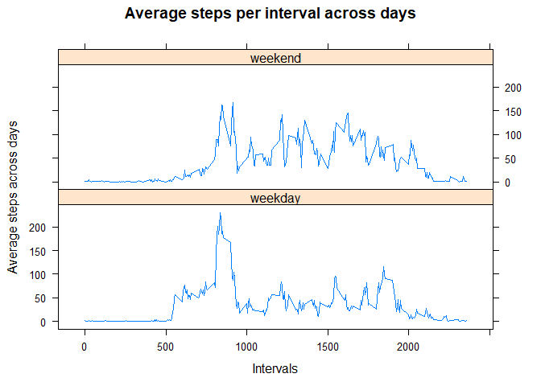

# Introduction

It is now possible to collect a large amount of data about personal movement using activity monitoring devices such as a [Fitbit][1], [Nike Fuelband][2], or [Jawbone Up][3]. These type of devices are part of the “quantified self” movement – a group of enthusiasts who take measurements about themselves regularly to improve their health, to find patterns in their behavior, or because they are tech geeks. But these data remain under-utilized both because the raw data are hard to obtain and there is a lack of statistical methods and software for processing and interpreting the data.

This assignment makes use of data from a personal activity monitoring device. This device collects data at 5 minute intervals through out the day. The data consists of two months of data from an anonymous individual collected during the months of October and November, 2012 and include the number of steps taken in 5 minute intervals each day.

The data for this assignment can be downloaded from the course web site:

- Dataset: [Activity monitoring data][4] [52K] 

The variables included in this dataset are:

- **steps**: Number of steps taken in a 5-minute interval (missing values are coded as NA) 
- **date**: The date on which the measurement was taken in YYYY-MM-DD format 
- **interval**: Identifier for the 5-minute interval in which measurement was taken 

The dataset is stored in a comma-separated-value (CSV) file and there are a total of 17,568 observations in this dataset.


## Loading and preprocessing the data 

In this part of the analysis I have loaded the raw data as is into R and then made some fundamental formatting improvements on the data to make it easy to analyse. 

```r
#Set variable for suppressing messages that are generated when loading libraries
hidemsg <- suppressPackageStartupMessages

#Load the libraries needed for this analysis
hidemsg(library(lubridate))
hidemsg(library(dplyr))
hidemsg(library(ggplot2))
hidemsg(library(lattice))

#Load the raw data from the zip file and format the dataset ready for analysis
unzip("activity.zip")
activity_data <- read.csv("activity.csv")
activity_data$date <- ymd(activity_data$date)
activity_data <- as_tibble(activity_data)
```


## What is mean total number of steps taken per day? 

In this part of the analysis I have ignored the missing values that are represented by NA within the dataset to get my results. 


```r
#Create a dataframe showing the total steps for each day
Daily_Totals <- activity_data %>%
  group_by(date) %>%
  summarize(Total_steps = sum(steps, na.rm = TRUE))
```

```
## `summarise()` ungrouping output (override with `.groups` argument)
```

```r
#Display a quick summary of Daily_Totals
summary(Daily_Totals)
```

```
##       date             Total_steps   
##  Min.   :2012-10-01   Min.   :    0  
##  1st Qu.:2012-10-16   1st Qu.: 6778  
##  Median :2012-10-31   Median :10395  
##  Mean   :2012-10-31   Mean   : 9354  
##  3rd Qu.:2012-11-15   3rd Qu.:12811  
##  Max.   :2012-11-30   Max.   :21194
```

```r
#Plot the histogram of the daily total steps
ggplot(Daily_Totals, aes(Total_steps)) +
  geom_histogram(binwidth = 3000,
                 fill = "green",
                 color = "red") +
  labs(title="Histogram of Total Daily Steps (NAs excluded)",
       x="Total Steps",
       y="Frequency")
```

<!-- -->

```r
#Calculate the mean and median of total steps per day
mean_steps_per_day = format(mean(Daily_Totals$Total_steps),
                            big.mark = ",")
median_steps_per_day = format(median(Daily_Totals$Total_steps),
                              big.mark = ",")
```

The above analysis on the total daily steps gives the following: 

- **Mean** = 9,354.23 
- **Median** = 10,395 


## What is the average daily activity pattern?

In this section I am analysing the daily activity pattern by plotting a time series of the 5-minute interval (x-axis) and the average number of steps taken, averaged across all days (y-axis). 


```r
#Claculate the average steps per interval across all days
Interval_ave <- activity_data %>%
  group_by(interval) %>%
  summarize(Ave_steps = mean(steps, na.rm = TRUE))
```

```
## `summarise()` ungrouping output (override with `.groups` argument)
```

```r
#Plot the time series plot of interval against average steps
ggplot(Interval_ave, aes(interval, Ave_steps)) +
  geom_line() +
  labs(title="Average number of steps per interval",
       x="Interval",
       y="Average steps across days")
```

<!-- -->

```r
#Identify the interval with the highest average steps
Highest_interval <- filter(Interval_ave, 
                           Ave_steps ==
                             max(Ave_steps))$interval
```

From the above analysis, the 5-minute interval with the highest average steps across all days is **835**.

## Imputing missing values

Note that there are a number of days/intervals where there are missing values (coded as NA). The presence of missing days may introduce bias into some calculations or summaries of the data. 


```r
#Filter out the data with NAs
Data_with_NA <- activity_data %>%
  filter(is.na(steps))

#Get the total number of rows in the data set containing NAs
Total_rows_with_NA <- format(nrow(Data_with_NA),
                              big.mark = ",")


#Get the percentage of NAs in the step values
steps_NA_ratio <- sprintf("%0.1f%%",
                          mean(is.na(activity_data$steps)) * 100)
```


On analysing the steps data we get that the number of missing values is 2,304 which is 13.1% of the total steps values. This is significant and has an impact on any calculations that we may make from the dataset. 

It is therefore critical to fill the missing values so as to make the analysis more accurate.

The strategy I have used for imputing missing data is to replace the missing values with the mean for that 5-minute interval across all days.


```r
#Replace the data in column for steps in the NA dataset with the interval average means
NA_Dataset_with_imputed_data <- Data_with_NA %>%
  select(- steps) %>%
  merge(Interval_ave) %>%
  rename(steps = Ave_steps)

#Create a new dataset copy of the original with missing data filled
Dataset_with_imputed_data <- activity_data %>%
  filter(!is.na(steps)) %>%
  bind_rows(NA_Dataset_with_imputed_data)

#Create a dataframe showing the total steps for each day using the new data set with missing values filled
Daily_Totals_imputed_data <- Dataset_with_imputed_data %>%
  group_by(date) %>%
  summarize(Total_steps = sum(steps))
```

```
## `summarise()` ungrouping output (override with `.groups` argument)
```

```r
#Plot the histogram of the total daily steps in the new dataset
ggplot(Daily_Totals_imputed_data, aes(Total_steps)) +
  geom_histogram(binwidth = 3000,
                 fill = "green",
                 color = "red") +
  labs(title="Histogram of Total Daily Steps (with NAs filled)",
       x="Total Steps",
       y="Frequency")
```

<!-- -->

```r
#Claculate the mean and median of the total daily steps in the new dataset
mean_steps_per_day2 =
  format(mean(Daily_Totals_imputed_data$Total_steps),
                            big.mark = ",")
median_steps_per_day2 =
  format(median(Daily_Totals_imputed_data$Total_steps),
                            big.mark = ",")
```

The above analysis on the total daily steps gives the following: 

- **Mean** = 10,766.19 
- **Median** = 10,766.19 

### Do these values differ from the estimates from the first part of the assignment?

In the first estimates with NAs omitted, the mean was less than the median thus implying the distribution is skewed to the left. On the other hand the second estimates with NAs filled has it's mean equal to it's median which implies the distribution is balanced.  

The values of the mean and median in this second estimate are higher than the values in the first estimate.  

### What is the impact of imputing missing data on the estimates of the total daily number of steps?

Imputing missing data has decreased the number of days having totals between 0 and 1,500 steps and has increased the number of days having totals between 10,500 and 13,500.  


## Are there differences in activity patterns between weekdays and weekends?

For me to answer this question, I have to add an extra variable in the dataset that indicates whether a given day is a weekday or a weekend.


```r
#Create a table that maps the days of the week to either the status weekday or weekend

mapping_table <- cbind(c("Sunday","Monday","Tuesday","Wednesday","Thursday","Friday","Saturday"), c("weekend","weekday","weekday","weekday","weekday","weekday","weekend"))

#Rename the variables with more descriptive names
colnames(mapping_table) = c("week_day","weekday_weekend")

#Create a variable that has value of the day of the week in the dataset with missing values filled-in then merge with mapping_table
Dataset_with_imputed_data <- Dataset_with_imputed_data %>%
  mutate(week_day = weekdays(date)) %>%
  merge(mapping_table)

#Create a summary table grouped by week day status and interval
Interval_ave_imputed_data <- Dataset_with_imputed_data %>%
  group_by(weekday_weekend, interval) %>%
  summarize(Ave_steps = mean(steps))
```

```
## `summarise()` regrouping output by 'weekday_weekend' (override with `.groups` argument)
```

```r
#Plot the panel of line plots
xyplot(Ave_steps ~ interval | factor(weekday_weekend),
       data = Interval_ave_imputed_data,
       type = "l",
       layout = c(1,2),
       xlab = "Intervals",
       ylab = "Average steps across days",
       main = "Average steps per interval across days")
```

<!-- -->

From the above panel charts comparing weekday trend and weekend trend we can conclude that this individual is more active throughout the day during weekends than weekdays. The highest level of activities happens during the weekdays.  

During the weekends the individual starts the day with a steady increase on activties hitting a high activity point in mid-morning. He/she then has a pattern of dips of low activity and quick rise in activity throughout the day then goes through slow decline in activity later in the evening.    

For weekdays, this individual starts with a sudden increase in activity in the early morning then has a major increase in activity that peaks at a higher value than weekends in mid morning. He/she then has a major decline in activities towards the evening.


[1]: http://www.fitbit.com/ "Fitbit"
[2]: http://www.nike.com/us/en_us/c/nikeplus-fuelband "Nike Fuelband"
[3]: https://jawbone.com/up "Jawbone Up"
[4]: https://d396qusza40orc.cloudfront.net/repdata%2Fdata%2Factivity.zip "Activity monitoring data"
